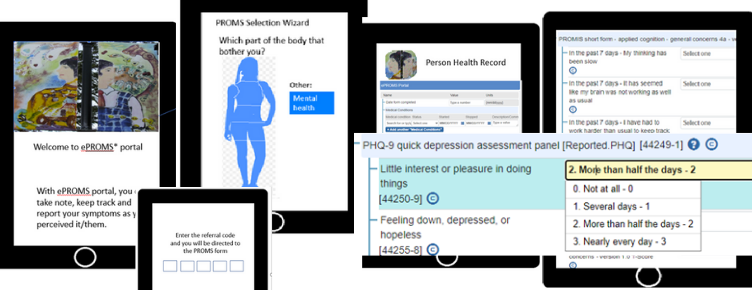
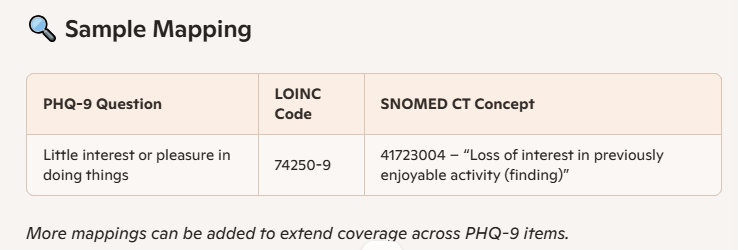
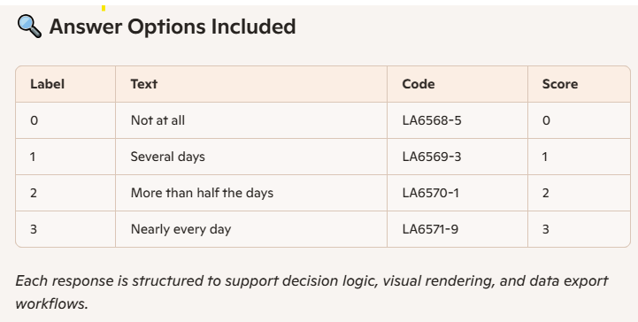

# 🩺 ePROMS Portal
📸   
*Field Project: HINF 597 – Health Terminology Standards*  
University of Victoria (2020) · _Ann K. Chou_

This technical implementation and case study explores how patient-reported outcomes (PROMs) can be semantically integrated into electronic health records using standards-based tools.

---

## ✨ Overview

The ePROMS Portal is a web interface that enables patients to report symptoms using validated PROMs.  
It supports patient-centered care by embedding PROM responses into EHRs through HL7 FHIR, SNOMED CT, and LOINC standards.

---

## 🎯 Purpose

This project demonstrates how mental health–related PROMs (e.g. PHQ-9) can be captured and modeled to amplify patient participation in digital care.  
These examples are useful for prototyping, education, and toolkit development.

---

## 💻 Features

- Built with LHC-Forms FHIR SDC tools  
- Uses validated PROMs like PHQ-9 and PROMIS  
- Outputs FHIR-compliant `Questionnaire` and `QuestionnaireResponse` resources  
- Includes LOINC and SNOMED CT mappings  
- Evaluated via heuristic inspection and cognitive walkthrough

---

## 🧠 Technical Implementation

I selected PHQ-9 (Patient Health Questionnaire–9) after reviewing multiple PROM instruments.  
The item I focused on:

> _"Little interest or pleasure in doing things"_

### 🔗 Standards Mapping

| Element           | Standard   | Code         | Description                                                  |
|------------------|------------|--------------|--------------------------------------------------------------|
| Question          | LOINC      | `74250-9`     | Little interest or pleasure in doing things                  |
| Clinical Concept  | SNOMED CT  | `41723004`    | Loss of interest in previously enjoyable activity (finding)  |

### 🧩 Answer Options

- `LA6568-5` – Not at all (score 0)  
- `LA6569-3` – Several days (score 1)  
- `LA6570-1` – More than half the days (score 2)  
- `LA6571-9` – Nearly every day (score 3)

These responses were structured for use with both FHIR Questionnaire and LHC-Forms JSON widgets.

---

## 🛠️ Implementation Components

- `phq9-questionnaire.json` – PHQ-9 as a FHIR Questionnaire  
- `phq9-questionnaire-response.json` – Sample patient response  
- `phq9-snomed-mapping.json` – SNOMED CT concept overlays  
- `sample-sample.json` – Custom LHC-Forms question section  
- All files follow HL7 FHIR and clinical terminology standards  
---
### 🛠️ Implementation Status
The ePROMS Portal is a partially implemented prototype using the HL7-compliant LHC-Forms toolkit. It showcases:
- Patient symptom entry using structured JSON questionnaires
- Standards mapping via FHIR, SNOMED CT, and LOINC
- Interface walkthroughs and usability exploration

🔧 While not a fully deployable system, the project demonstrates how Patient Health Record (PHR) systems can incorporate PROMs with minimal integration—provided they adopt JSON-formatted resources based on these standards.

please read `LHC-form-set-up-guide.md` to implement LHC-ready json

---
## 📝 Simplified Online Report

The ePROMS Portal case study is available as a web-accessible version featuring interface walkthroughs, technical context, and visual design notes.

🌐 [Visit the Simplified Report](https://annchou.github.io/eproms-portal/)

## 📘 Academic Report (Available by Request)

This portal was developed during a graduate health informatics course while navigating illness and time constraints.  
The original report includes instructor feedback and rough early notes.

To preserve its context but honor its roughness, the report isn’t publicly hosted here.

📨 Educators or researchers may request it via [annchou.github.io](https://annchou.github.io) or [@annreflection](https://instagram.com/annreflection).

---

## 🧩 Standards & Tools Used

- [HL7 FHIR STU4](https://www.hl7.org/fhir/)  
- [LOINC](https://loinc.org/)  
- [SNOMED CT](https://www.snomed.org/)  
- SMART on FHIR API  
- [LHC-Forms Toolkit] (https://lhncbc.github.io/lforms/)

---

## 📂 Repository Contents

- `index.html` – Simplified case study report and landing page  
- `rss/` – Screenshots, figures, and prototype visuals  
- `json/` – FHIR and SNOMED CT–compliant resources

---

## 📄 JSON Resource Highlights

### 9-sections.lforms.json
9-sections.lforms.json is a questionnaire definition file used in the ePROMS portal.
It follows the LHC-Forms (LForms) JSON format, which is compatible with HL7 FHIR and LOINC standards for healthcare data collection.

Purpose:
This file defines a multi-section, patient-reported outcome form that is presented to users in the portal. It is designed for patients to self-report symptoms, experiences, or other health-related information.

Structure:
The file contains:

Metadata (title, version, etc.)
9 distinct sections (groups of related questions)
Questions and answer options for each section
Data types, validation rules, and coding (e.g., LOINC codes)
How it’s used:
The web portal loads this JSON file and renders it as an interactive form for patients. After the patient fills it out, their responses are structured as a FHIR QuestionnaireResponse for downstream processing, storage, or integration with other healthcare systems.

🌐 Live Preview
Want to see it in action? Visit [miniportal.html] (miniportal.html), which dynamically loads and renders 9-sections.lforms.json inside the page.

### 📄 PHQ-9 Questionnaire

FHIR-compliant structured Questionnaire.

✅ Features:  
- Based on LOINC `44249-1`  
- LHC-Forms compatible  
- Answer options coded for interoperability

📁 [Download JSON](rss/phq9-questionnaire.json)

---

### 📄 QuestionnaireResponse

Patient response to PHQ-9.

✅ Features:  
- Matches `phq9-questionnaire.json`  
- Coded answers using LOINC  
- Includes decimal scoring and timestamps

📁 [Download JSON](rss/phq9-questionnaire-response.json)

---

### 🧠 SNOMED CT Mapping

Maps PHQ-9 items to clinical findings.

✅ Example:  
`74250-9` → SNOMED `41723004` – "Loss of interest in previously enjoyable activity"

📸   
📁 [Download JSON](rss/phq9-snomed-mapping.json)

---

### 🧩 Custom LHC-Forms Section

Filename: `sample-sample.json`

✅ Features:  
- LOINC coded item: "Little interest or pleasure in doing things"  
- Scored dropdown options  
- Designed for form rendering and analytics

📸   
📁 [Download JSON](rss/phq9-custom-section.json)

---

## 🔮 Next Steps

- Explore visual symptom drawing modalities  
- Revise PROMs for cultural accessibility  
- Engage patient partners in participatory testing

---

## 📘 Reflections

> “How might patient stories reshape digital systems?”

ePROMS isn't just a prototype—it’s a reflection on how health tools can hold softness, context, and care.  
It asks systems to listen before deciding.

🪡 _May this portal be a seed for architectures that bend toward truth, not just function._

_Ann K. Chou_  
[@annreflection](https://www.instagram.com/annreflection) · [annchou.github.io](https://annchou.github.io)

---

## 👩‍💻 About Me

Designer & informatics researcher exploring the intersection of care, creativity, and computation.

I work with HL7 FHIR, D3.js, and Unity to prototype inclusive systems—from clinical symptom portals to sensory play interfaces.

🌿 Health IT · Accessibility · Creative Tech  
🎨 Sumi-e x Unity · Music Tools · Visual Reasoning  
📍 Based in British Columbia
